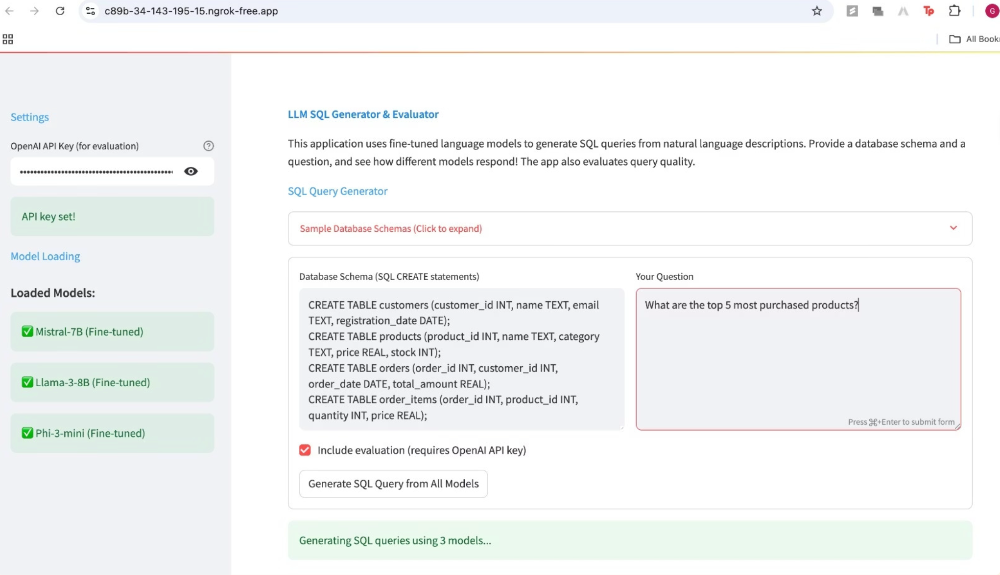
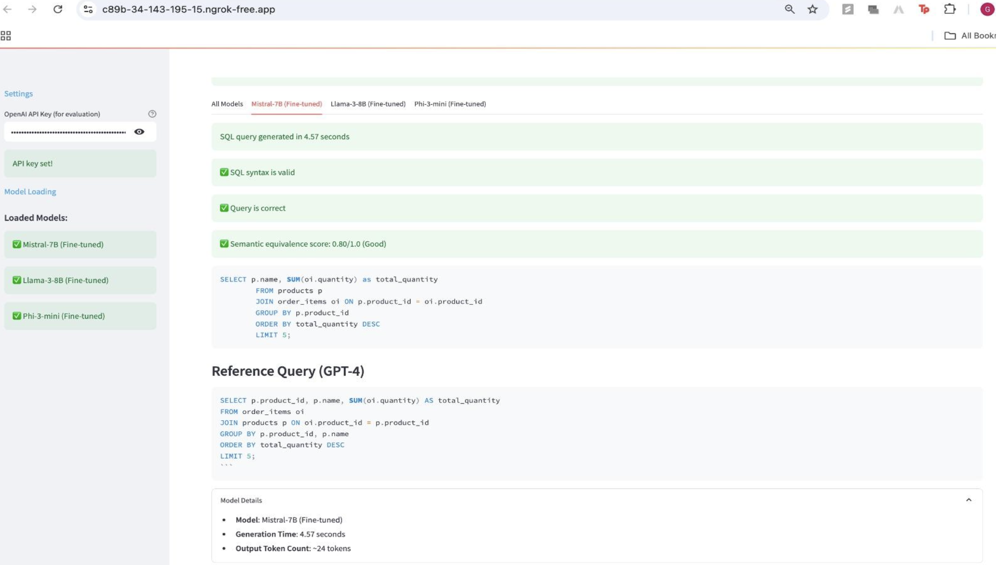
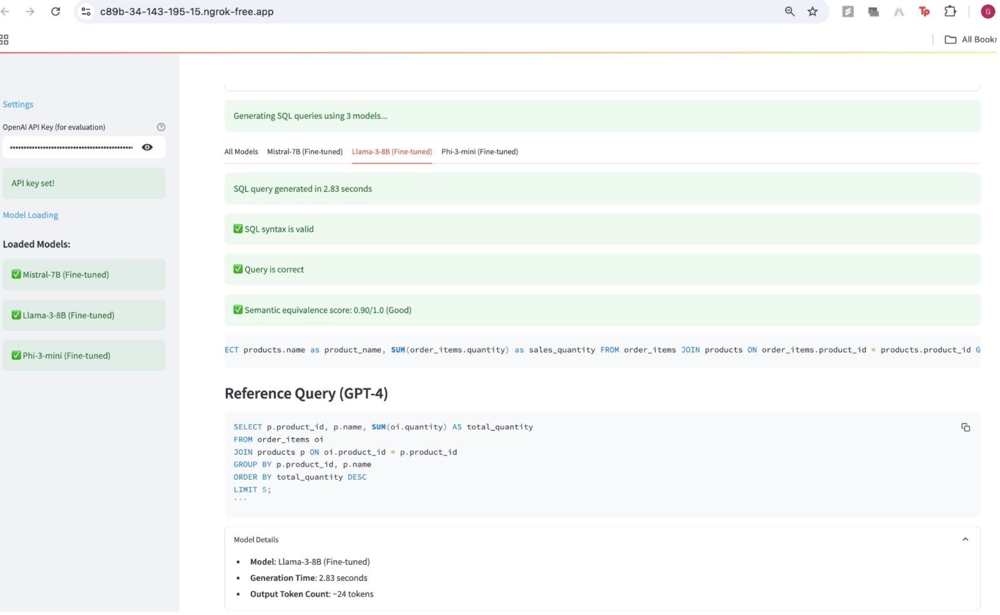
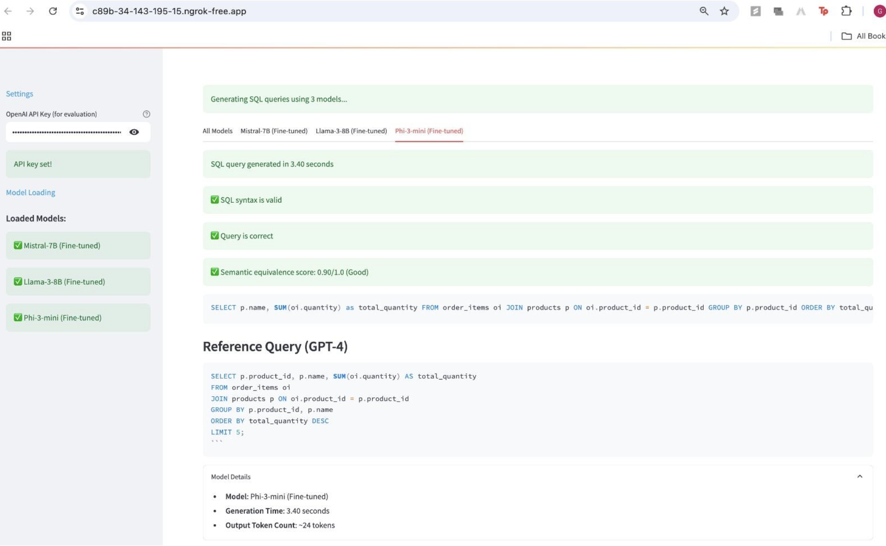
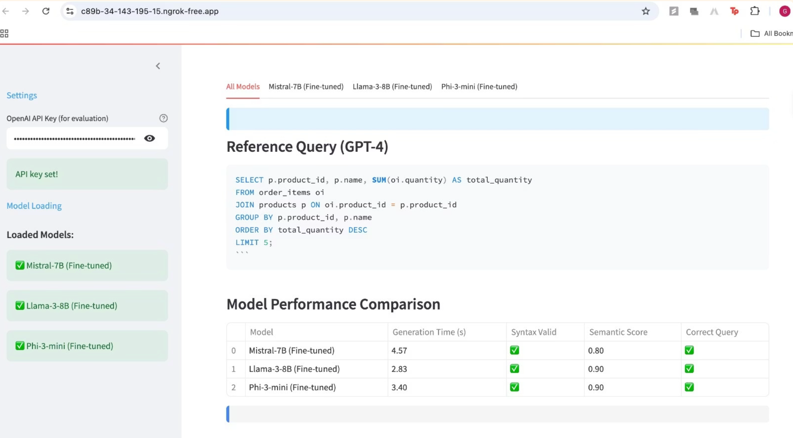

# 🔍 Natural Language to SQL using Fine-Tuned LLMs

## Overview

This project builds a natural language to SQL (NL2SQL) query generation system using fine-tuned large language models (LLMs). The models are optimized using **Low-Rank Adaptation (LoRA)** and evaluated using semantic and syntactic metrics to ensure high-quality, reliable SQL query generation across diverse schemas.

---

## 🚀 Features

- **Multi-Model Fine-Tuning**:  
  Fine-tuned **Mistral-7B**, **LLaMA-3-8B**, and **Phi-3-mini** using LoRA and Unsloth on a synthetic text-to-SQL dataset.

- **Complex Query Generation**:  
  Supports joins, filters, aggregations, and multi-table queries across dynamic schema definitions.

- **Model-Aware Prompt Formatting**:  
  Uses architecture-specific prompt formats to align with pretraining objectives and boost instruction-following behavior.

- **Evaluation Framework**:
  - **Semantic Equivalence** (via GPT-4 using RAGAS)  
  - **Exact Match**  
  - **SQL Syntax Validity** (via SQLGlot)

- **Lightweight & Efficient**:  
  Fine-tuning is memory-efficient using 4-bit quantization and LoRA adapters, making the solution practical even on limited hardware.

---

## 🧰 How to Use

### 1. Environment Setup

Install required packages:
```bash
pip install unsloth datasets sqlglot ragas openai streamlit
```

### 2. Fine-Tuning (Optional)

Refer to `111_training.ipynb` for complete fine-tuning with LoRA using `SFTTrainer`.

### 3. Run the Demo UI

Open `demo.ipynb` in Google Colab:

- Loads all three fine-tuned models
- Accepts schema + natural language query
- Displays SQL outputs and evaluation metrics
- Supports semantic and syntax scoring using RAGAS (GPT-4)

### 4. Example Input/Output

**Prompt**: "Show all customers from New York"  
**Schema**:
```sql
CREATE TABLE customers (id INT, name TEXT, city TEXT);
```

**Generated SQL**:
```sql
SELECT * FROM customers WHERE city = 'New York';
```

---

## 🖼️ UI Screenshots

### 🔹 Input Interface

*Enter schema, natural language prompt, and choose evaluation settings.*


---

### 🔹 Model Comparison Output


*Side-by-side comparison of SQL queries generated by Mistral, LLaMA, and Phi models.*

1. **Mistral-7B Output**


2. **LLaMA-3-8B Output**


3. **Phi-3-mini Output**



---

### 🔹 Evaluation Metrics Display

*Includes syntax validity, exact match, and semantic equivalence scores.*



---

## 📈 Key Insights

- LoRA enables efficient and practical fine-tuning of large models on limited hardware.
- Mistral-7B delivered the most balanced improvements across all metrics.
- Even compact models like Phi-3-mini can produce accurate SQL with proper formatting and tuning.
- Evaluation using LLM-based semantic scoring (via RAGAS + GPT-4) is critical for assessing SQL correctness beyond exact match.

---

## 📌 Future Work

- Extend to real-world benchmarks like Spider/WikiSQL.
- Add schema visualizations and debugging tools in the UI.

---
